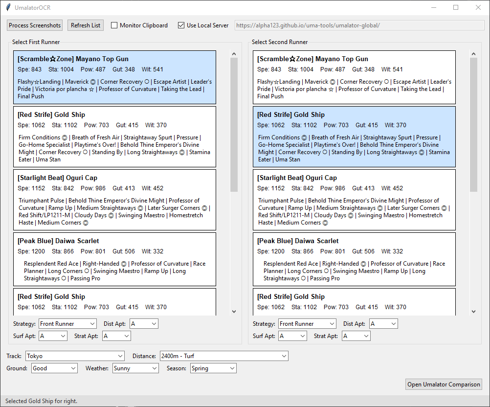

# umalator-ocr

Fork/Derivative of [umamusme-ocr](https://github.com/ehuntzbe/umamusume-ocr) from ehuntzbe, with the intention of combining everything into one single GUI application.

UmalatorOCR is a tool for extracting Veteran Umamusume data from screenshots using OCR (Optical Character Recognition) for use on the [Umalator](https://alpha123.github.io/uma-tools/umalator-global/).

Outputs to the Umalator can be self-hosted or used on the public instance.

## Features

- OCR extraction of:
  - Name & epithet
  - Core stats
  - Surface, Distance, and Style aptitudes (with defaults if detection fails)
  - Skills 
- Automatic CSV export (`runners.csv`)
- Local server (on your computer) or external umalator server support for comparison.



## Requirements

- **Python**: 3.9+ recommended
- **System dependencies**:
  - [Tkinter](https://wiki.python.org/moin/TkInter) (ships with Python on Windows/macOS; on Linux install with `sudo apt-get install python3-tk`)
  - [Git](https://git-scm.com/) (needed for pulling icons/resources, must be installed and in PATH)

## Installation

1. Ensure Tkinter and Git are installed on your system.

2. Clone the repository:

   ```
   bash
   git clone https://github.com/LegifyX/umalator-ocr.git
   cd umalator-ocr
   ```

3. Install Python dependencies:

   ```
   bash
   pip install -r requirements.txt
   ```

## Configuration

Create a .env file in the project root (example below), or edit the .env.example file and rename it to .env.:

```
# Logging level (INFO or DEBUG)
# Valid levels: DEBUG, INFO, WARNING, ERROR, CRITICAL
LOG_LEVEL=INFO
```

## Usage

Run the GUI application:

```
python UmalatorOCR.py

```

Processing screenshots:
1. Place your Veteran Umamusume screenshots in the `data` directory.
2. Click "Process Screenshots" in the GUI.
3. The extracted data will be saved to `runners.csv` also in the `data` directory.
4. Processed Umas will be found in the `data/processed` directory.

- Make sure to capture the entire window, not just up to the skills. You must capture everything including the "close" button in the bottom of the image.

Alternatively, you can tick the `Monitor Clipboard` option to automatically process screenshots copied to your clipboard.

Use your operating system's shortcut to capture a region of the screen and copy it to the clipboard:

- **Windows**: `Win+Shift+S`
- **macOS**: `Cmd+Ctrl+Shift+4`
- **Linux**: use your desktop environment's screenshot tool (e.g., `gnome-screenshot -a`)

Outputting Screenshots to Umalator:
- By default, the application is set to output to a local Umalator instance.
- To change this, edit the `UMALATOR_URL` variable in the top right of the GUI. The default external host is: https://alpha123.github.io/uma-tools/umalator-global/
- Pick your two veteran umamusume.
- Pick the Strategy, Surface, Distance, and Style aptitudes if they are not correct.
- Pick the track, weather, and ground condition.
- Click "Open Umalator Comparison" to open the Umalator in your web browser with the data pre-filled.

Debugging:
- Enable DEBUG logging in the .env file to see detailed logs.
- If `LOG_LEVEL=DEBUG` is set in `.env`:
  - OCR bounding boxes and aptitude block extractions will be saved and viewable.
  - JSON dumps of raw OCR results will be written for analysis will be saved and viewable.

Legacy:
- [umamusme-ocr](https://github.com/ehuntzbe/umamusume-ocr) files with my original fix to uma_ocr_to_csv.py for the windowed application screenshots not being properly recognized remain in the git. These files are still functional.
- For more information on how to use those tools, please refer to the original repository.

## Development notes

- Aptitudes defaults are A if detection fails.
- Style default is Front Runner if detection fails.

## Known Issues
- OCR accuracy may vary based on screenshot quality and resolution.
- OCR of the aptitudes (Track, Distance, Style) may not always be accurate. Sometimes the OCR just does not want to co-operate.
- Selection of the Style for the veteran umaumsume may not always be accurate. This code is somewhat experimental.
- Some skills may not be recognized correctly, especially if they are partially obscured.
- Unique skills may register as the original unique skill even when inherited. If this is the case, please fix this in the Umalator yourself.

## Licensing and Dependencies

This project leverages three related open-source repositories:

- [uma-tools](https://github.com/alpha123/uma-tools) for general Uma Musume data utilities
- [uma-skill-tools](https://github.com/alpha123/uma-skill-tools) for skill-related processing
- [umamusume-ocr](https://github.com/ehuntzbe/umamusume-ocr) for the original idea and OCR processing code.

Please review and comply with the licenses provided by those upstream projects (for example, `uma-skill-tools` is GPLv3). This repository is itself distributed under the [GNU General Public License v3](LICENSE), and contributions must remain compatible with both the GPLv3 and the licenses of the above repositories.

## Code Generation

Most of the source code in this repository was generated with the help of OpenAI's ChatGPT, Google's Gemini, and used Deepseek R1 models which were subsequently refined.


